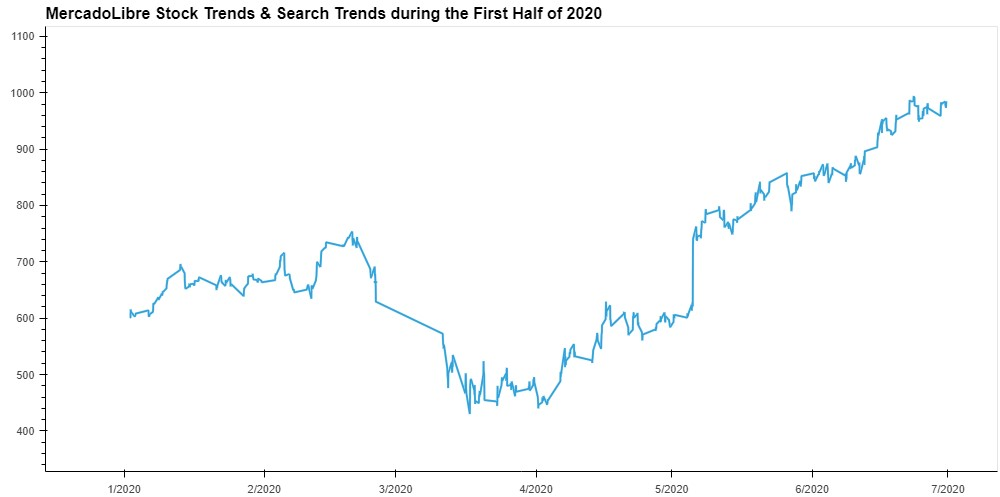

# timeseries-homework
## [Google Colab link](https://drive.google.com/file/d/156uFIkBhIXeCLGP5Gdrnl03RLtreaJn5/view?usp=sharing)
# MercadoLibreLinks Analyst 

# I'm a growth analyst at MercadoLibreLinks to an external site.. With over 200 million users, MercadoLibre is the most popular e-commerce site in Latin America. I've been tasked with analysing the company's financial and user data in clever ways to help the company grow. So, I want to find out if the ability to predict search traffic can translate into the ability to successfully trade the stock.

## First I ploted the data for the Google search trends based on the company and focused on the month of May

## Then with that data I checked out the traffic based on the day of the week

## I then dove deeper with a heatmap cisualization of the hour and day of the week for the Search Traffic

## Then I took a look at the Stock trends and the connection between the Search traffic

### I found that as the stock price increases in value, the search traffic becomes increasingly volatile.

## I then used Prophet to predict and forecast possible trends of what the company could be looking at

## I then used the data from Prophet to figure out the yhat(prediction) and the uncertianty of that prediction(yhat_lower, yhat_upper)

## Then I plotted the trends over the year,week, and how it would look on a daily basis 

### Useing this data we can find what the peak times are to push for advertising or other marketing areas.

## Then produced a Sales forecast to predict future sales based on the information provided and the analysis done

### Using that I setup a dataframe and calculated the most likely, best and worst case with the predictions

